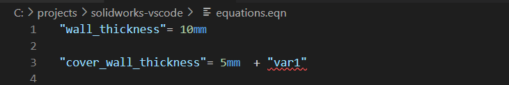

# solidworks README

This is a VSCode extension for highlighting and parsing Solidworks equations files

## Features

Basic highlighting of
 - variables
 - units
 - dimensions on sketches

Basic linting
 - detection of undefined variables usage
 

## Scope

Extension is preset to work with .eqn file extensions
