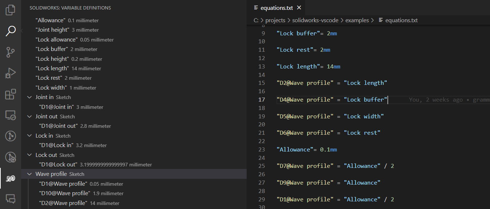

# Solidworks Equations README

This VSCode extension offers convenience features when working with Dassault Solidworks' equations. It offers syntax highlighting, linting and on-the-fly evaluation variables and smart dimensions.

## Features

### Syntax Highlighting

- **Variables**: Easily distinguish variables within your SolidWorks equations and scripts.
- **Units**: Quickly identify units to ensure they are correctly applied to variables and equations.
- **Dimensions**: Enhance the readability of dimensions in sketches, making it easier to work with complex designs.

### Linting

- **Undefined Variables Detection**: Automatically detect and highlight the usage of undefined variables, helping to reduce errors in your equations and scripts. Linting is done by an LSP backend, through building a full variable dependency graph.

### Navigation

- **Equations evaluation**: Variables and smart dimensions defined through equations are automatically evaluated and structured on a covenient side panel, assorted by sketch. Clicking on a variable jumps to the relevant equation defining it.

  

- **Jump to Variable Definition**: Effortlessly navigate to the definition of variables within your project, improving your efficiency in managing and updating equations.

  

## Scope

Extension is preset to work with .eqn and .txt file extensions

## Installation

1. Open Visual Studio Code.
2. Go to the Extensions view by clicking on the square icon on the sidebar or pressing `Ctrl+Shift+X`.
3. Search for "SolidWorks" or "Solidworks equations" in the Extensions marketplace search bar.
4. Click on the Install button to install the extension.

## Usage

Once installed, the extension automatically activates the following features when you open a SolidWorks equations file or script:

- Syntax highlighting activates based on the file content, with no additional setup required.
- Linting and variables and measurements evaluation runs automatically on file being opened or changes being made.
- To use the "Jump to Variable Definition" feature, simply hover over a variable and right-click, then select "Go to Definition" from the context menu.

## Contributing

Contributions to the SolidWorks Helper Extension are welcome! Whether it's reporting bugs, suggesting new features, or contributing to the code, we appreciate your input.

## License

This project is licensed under the MIT License - see the LICENSE file for details.

## Acknowledgments

- Thanks to the SolidWorks community for the continuous feedback and support.
- Special thanks to the [Pint](https://github.com/hgrecco/pint) project for providing a powerful yet easy-to-use library for handling units in Python.
- Special thanks to [ANTLR](https://github.com/antlr/antlr4) for their powerful tool that makes it possible to easily build parsers for any language.
- Special thanks to Dassault Systèmes for creating SolidWorks, a powerful tool that inspires this extension.
